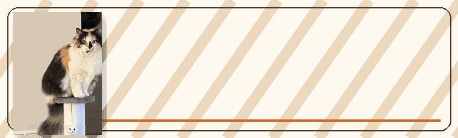
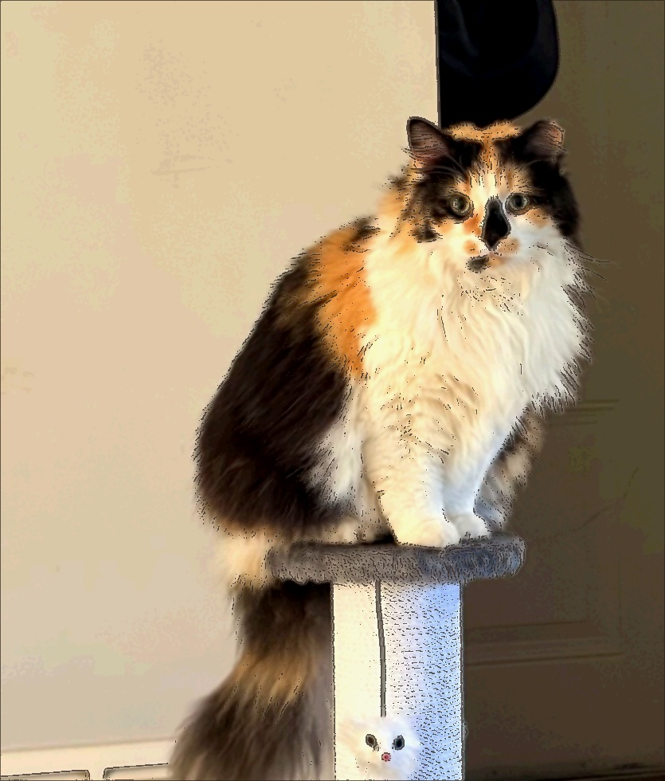

  

# Chloe On A Pedastal

  

  
  
  
  

  
  
  
  
  

  

  <em>A 50-piece browser jigsaw built from a cropped, cartoon-styled Chloe photo — ladder removed, pedestal restored.</em>

---

## Play it

**Live:** [dacameragirl.github.io/Chloe_On_A_Pedastal](https://dacameragirl.github.io/Chloe_On_A_Pedastal/)

No build step. Open `index.html` in a browser, or use the live link above.

## Controls

| Button | What it does |
|--------|----------------|
| **Shuffle** | Mixes all 50 pieces into the tray |
| **Hint** | Briefly shows the full photo behind the board |
| **Solve** | Places every piece in the correct slot |
| **Reset** | Returns pieces to the tray in order |
| **Photo** | Loads another local image as the puzzle |

**Tips:** Drag pieces onto the board, click a piece then click a slot, or double-click a piece to send it back to the tray.

## How it works

- **5 × 10 grid** — 50 interlocking SVG jigsaw pieces
- **Pointer drag** — pieces snap to slots; release over the last hovered slot if the cursor misses
- **Custom photo** — swap in any image without touching the code
- **Responsive layout** — board + tray reflow on mobile

## Files

| File | Role |
|------|------|
| `index.html` | App shell |
| `styles.css` | Warm brown/orange layout + board grid |
| `puzzle.js` | Piece generation, drag-drop, win state |
| `assets/chloe-cartoon.jpg` | Default cartoon puzzle image |
| `assets/chloe-puzzle.jpg` | Cropped photo source |
| `Chloe.jpg` | Original full photo |

## Recent fix

[PR #1](https://github.com/DaCameraGirl/Chloe_On_A_Pedastal/pull/1) — drag-and-drop no longer leaves pieces frozen mid-air when you release over the board.

---

  <strong>Chloe On A Pedastal</strong> — put the cat back on her pedestal. 
  <a href="https://github.com/DaCameraGirl">Angela Hudson</a> · Grok in Cursor · June 2026 
  orange for Chloe · green when she&apos;s home · no ladder required

